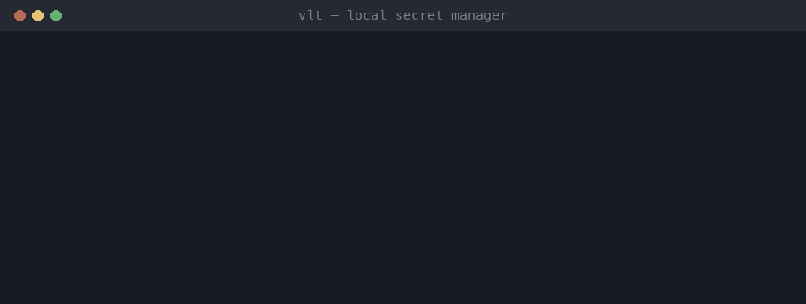

# vlt

AI開発者のための軽量シークレットマネージャー。

APIキーを `.env` ファイルにばらまくのはやめましょう。`vlt` はシークレットを暗号化されたローカルvaultに保存し、`vlt://` 参照を実行時に解決します。機密情報がディスクやgit履歴に残ることはありません。



## 特徴

- **AES-256-GCM** 暗号化ローカルvault（SQLite）
- **OS Keychain** 連携によるマスターキー管理（macOS Keychain）
- **`vlt://` 参照スキーム** — 環境変数に参照を設定し、実行時に解決
- **ゼロコンフィグ** — 単一バイナリ、デーモン不要、クラウドアカウント不要
- **シェル統合** — `eval "$(vlt env)"` でシームレスなワークフロー
- **出力の伏せ字** — `vlt run` の子が出力した秘密を、ログ・CI・AI エージェントの記録では `<concealed by vlt>` に置き換え
- **環境変数の項目** — 変数の組を vault に置き、`vlt run --env` でまとめて注入（.env をディスクに置かない）

## インストール

vlt は macOS 専用です（マスターキーを macOS のキーチェーンに置くため）。

### Homebrew

```bash
brew install bayfront-software/tap/vlt
```

Homebrew はソースからビルドするので、インストールや更新の後の初回は、キーチェーンの項目への
アクセス許可を求められます。「常に許可」を選んでください。

### ソースからビルド（Rust 1.70+ 必要）

```bash
cargo install --path .
```

### GitHubからビルド

```bash
git clone https://github.com/Bayfront-Software/vlt.git
cd vlt
cargo build --release
cp target/release/vlt ~/.cargo/bin/
```

## クイックスタート

```bash
# vault を初期化（マスターキーをOS Keychainに保存）
vlt init

# シークレットを保存
vlt set openai/api-key "sk-..."
vlt set anthropic/api-key "sk-ant-..."

# パイプで入力
cat key.txt | vlt set github/token

# シークレットを取得
vlt get openai/api-key

# 全キーを一覧表示
vlt list

# シークレットを削除
vlt delete openai/api-key
```

## 使い方

### シークレットを解決してコマンド実行

環境変数に `vlt://` 参照を設定し、`vlt run` でインメモリ解決してからコマンドを実行します：

```bash
OPENAI_API_KEY="vlt://openai/api-key" vlt run -- python app.py
```

子プロセスには実際のシークレット値が渡されます。参照文字列がシェル設定の外に出ることはありません。

### シェル統合

`~/.zshrc` や `~/.bashrc` に追加：

```bash
export OPENAI_API_KEY="vlt://openai/api-key"
export ANTHROPIC_API_KEY="vlt://anthropic/api-key"
```

`vlt run` 経由で任意のツールを起動：

```bash
vlt run -- claude
vlt run -- python train.py
```

または現在のシェルに解決済みシークレットをエクスポート：

```bash
eval "$(vlt env)"
```

## バイナリシークレットと持ち出しバックアップ

署名鍵や証明書などのファイルをそのまま保存できます:

```bash
# ファイルを保存
vlt set android/upload-keystore --file ~/keystores/upload.jks

# 復元（バイナリは --out 必須）
vlt get android/upload-keystore --out ./upload.jks
```

マスターキーは OS Keychain から出ないため、`vault.db` の
コピー単体ではバックアップになりません。マシン非依存のバックアップは
パスフレーズ暗号化された `.vltx` を使います:

```bash
# 全件エクスポート（パスフレーズ入力を求める。argon2id + AES-256-GCM）
vlt export backup.vltx

# 任意のマシンで復元（既存キーはスキップ。--overwrite で上書き）
vlt import backup.vltx --overwrite
```

スクリプトからは `VLT_PASSPHRASE` で非対話にでき、`VLT_DB` で
vault の保存先を差し替えられます（復元検証用の一時 vault に便利）。

`vlt init` は既存マスターキーがあると失敗します（再初期化すると現在の
vault が復号不能になるため）。`vlt export` 後に `--force` でのみ実行可能。

## 仕組み

```
┌──────────────────────────────────────┐
│  vlt CLI                             │
│  init / set / get / run / env        │
├──────────────────────────────────────┤
│  解決エンジン                          │
│  環境変数の vlt:// 参照をスキャン        │
│  インメモリでのみ置換                    │
├──────────────┬───────────────────────┤
│  マスターキー  │  暗号化Vault           │
│  OS Keychain │  SQLite + AES-256-GCM │
└──────────────┴───────────────────────┘
```

1. `vlt init` が256ビットのマスターキーを生成し、OS Keychainに保存
2. `vlt set` が各シークレット値をAES-256-GCM（値ごとに固有のnonce）で暗号化し、ローカルのSQLiteデータベースに保存
3. `vlt run` が環境変数から `vlt://` プレフィックスをスキャンし、参照されたシークレットを復号して `exec` で子プロセスに渡す
4. シークレットが平文で存在するのはプロセスメモリ上のみ — ディスクにもgitにも残らない

## セキュリティモデル

| レイヤー | 実装 |
|---|---|
| 暗号化 | AES-256-GCM（値ごとにランダム12バイトnonce） |
| 鍵管理 | macOS Keychain（システム認証で保護） |
| Vault保管先 | `~/Library/Application Support/vlt/vault.db` |
| 実行時 | シークレットはプロセスメモリ上のみ、envで子プロセスに渡す |

## ライセンス

MIT

## コントリビュート

コントリビュート歓迎です。変更を加える前に、まずissueを開いて議論してください。

## 種類つき項目・秘密参照など（v0.3）

項目は 1Password を手本にした種類を持ちます（ログイン・パスワード・API 認証情報・セキュアノート・
クレジットカード・個人情報・SSH 鍵・データベース・サーバー・ソフトウェアライセンス・Wi-Fi・
銀行口座・書類）。種類ごとの主役フィールドに加え、カスタムフィールド・メモ・タグ・お気に入りを
持てます。v0.2 の項目はそのまま使えます（テキストはパスワード、バイナリは書類として扱います）。

秘密参照は 1Password の `op://` と同じ感覚で使えます。

```bash
vlt read vlt://github/login/username          # フィールドを id かラベルで指定
vlt read vlt://openai/api-key                 # 主役フィールド
vlt read 'vlt://github/login?attribute=otp'   # ワンタイムパスワードの現在のコード
vlt inject -i config.tpl -o config.yml        # {{ vlt://... }} を置き換える
vlt run --env-file .env -- npm start          # .env の値に vlt:// 参照を書ける
vlt show github/login                         # フィールドと参照の一覧（値は伏せる）
```

ほかに `vlt set <key> <value> [--field f] [--type login]`、`vlt get <key> [--field f]`、
`vlt totp <key>`、`vlt generate`、`vlt types`、`vlt delete`（ゴミ箱へ）、`vlt restore`、`vlt trash`。

## コマンドへの秘密の注入

```bash
# 変数の組を vault に置く（1Password Environments / envchain 相当）
vlt set envs/myapp 'postgres://app:pw@db/app' --type environment --field DATABASE_URL
vlt set envs/myapp 'vlt://db/${APP_ENV:-dev}/password' --field DB_PASSWORD   # 値に参照も書ける
vlt run --env envs/myapp -- npm start
APP_ENV=prod vlt run --env envs/myapp -- ./deploy.sh

# direnv を使うなら .envrc に
eval "$(vlt env --env envs/myapp)"
```

**伏せ字.** コマンドの出力が端末でないとき（パイプ・ログ・CI・AI エージェント）は、標準出力と
標準エラーに出た秘密の値を `<concealed by vlt>` に置き換えます。端末への出力はそのままにするので、
`vlt run -- claude` のような対話型のプログラムも動きます。どこでも伏せる `op run` とは既定が違います。
常に伏せるなら `--mask`、伏せないなら `--no-masking`。コマンドの終了コードはそのまま返します。

**スクリプト向け.** `vlt list --json`、`vlt show <key> --json`（伏せる値は `--reveal` が無ければ null）、
`vlt read <参照> --out <ファイル>`（権限 600）、`vlt completions zsh|bash|fish`。

## デスクトップアプリ（GUI）

デスクトップアプリは、今はダウンロード配布していません。使う場合はソースからビルドしてください。

`gui/` は Rust コアを共用する Tauri 2 アプリで、1Password 8 風の3列構成です
（サイドバー：すべて／お気に入り／要確認／種類／タグ／ゴミ箱、検索つき一覧、詳細）。

- Touch ID（または Mac のパスワード）で解錠。無操作・画面ロック・スリープで自動ロック。
- 値は「表示」を押すまで伏せたまま。コピーは履歴アプリに残らない印付きで、一定時間後に消去。
  大きく表示、強度つきのパスワード生成、ワンタイムパスワードの表示。
- 全フィールドに「秘密参照をコピー」。弱い・使い回しのパスワードを検出。
- ⌘⇧Space でどこからでも呼び出し。⌘C で主役、⌘⇧C でユーザー名をコピー。

```bash
./scripts/install.sh   # ビルド・署名（失効した証明書は避ける）・CLI とアプリのインストール
cd gui && npm run verify
```

## 支援

vlt は無料のオープンソース（MIT）です。役に立ったら
[GitHub Sponsors で開発を支援](https://github.com/sponsors/gzer0-dev)していただけると励みになります。
